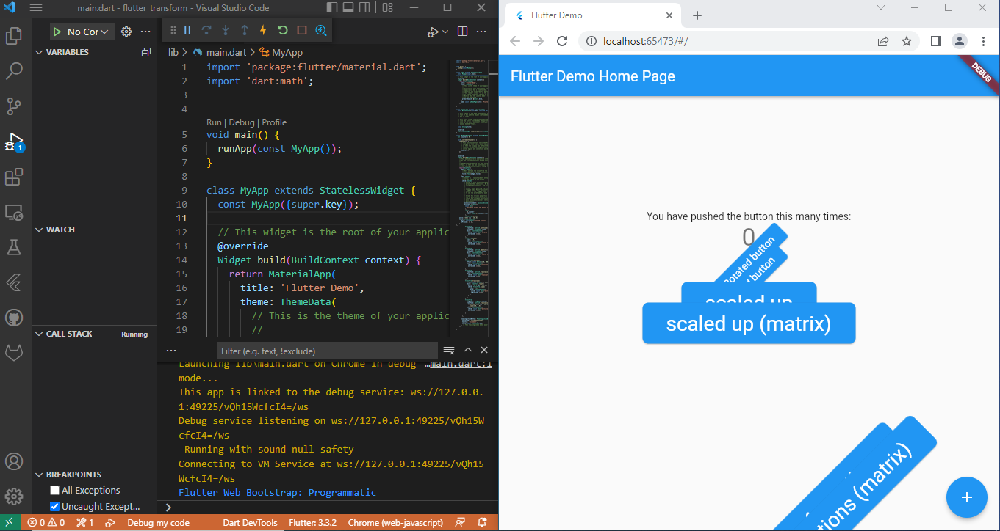
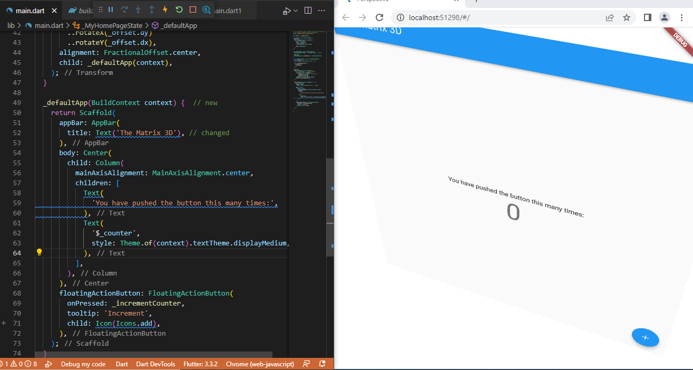
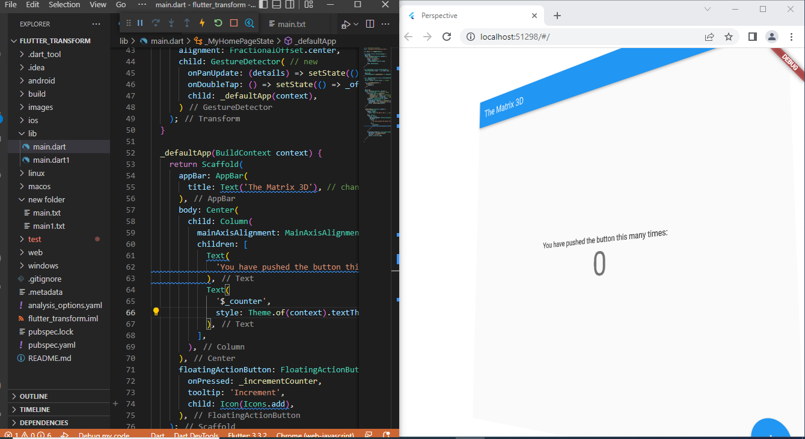
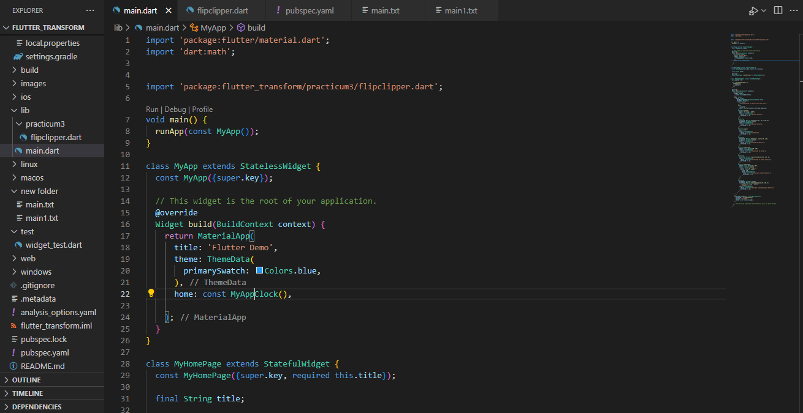
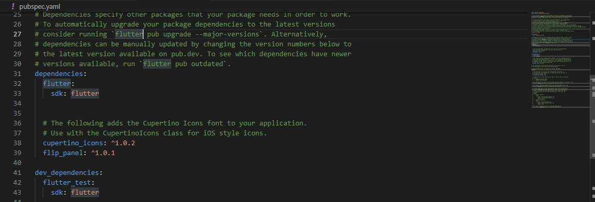
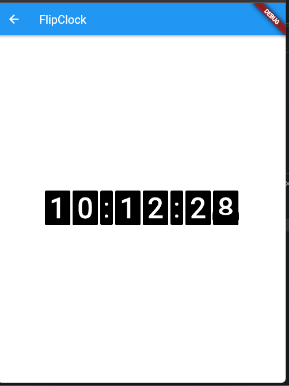

# flutter_transform

Baggio Deroger

Practicum:

1- Creating project and test running the app:

2- Using transform widget and adding perspective:

3- Using GestureDetector widget:

4- Implementing flip panel to create a countdown timer:

5- adding the needed dependencies:

6- Countdown timer running!

